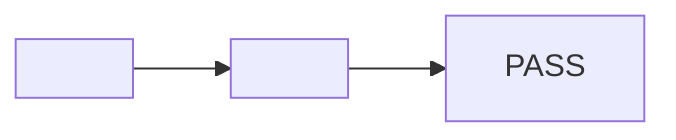

# QA PR Hosted Video Evidence Implementation Plan

> **For agentic workers:** REQUIRED SUB-SKILL: Use superpowers:subagent-driven-development (recommended) or superpowers:executing-plans to implement this plan task-by-task. Steps use checkbox (`- [ ]`) syntax for tracking.

**Goal:** Upgrade `qa-pr` to produce a commit-bound evidence bundle consisting of one chaptered MP4, one Snapdoc Markdown report, and one sticky PR comment, then benchmark the behavior against a real PR snapshot (#1614).

**Architecture:** Keep `qa-ticket` as the acceptance-test engine. Add one deterministic Python media builder for WebM clips, disclose report/comment formatting in a reference file, and keep orchestration, privacy, SHA gates, Snapdoc lifecycle, and fallback decisions in `qa-pr/SKILL.md`. Measure process predictability with a five-run before/after benchmark using an immutable snapshot of a real PR (#1614), plus targeted pressure cases.

**Tech Stack:** Markdown agent skill, Python 3 standard library, `unittest`, `agent-browser`, `ffmpeg`/`ffprobe`, Snapdoc CLI 0.0.10+, GitHub `gh`, Bitbucket `bt`.

## Global Constraints

- `qa-ticket` remains the single source of truth for acceptance-test planning and execution.
- Application QA stays on localhost. The hosted Cloudflare preview is metadata only and is never used as the QA target.
- Record one sanitized WebM clip per meaningful frontend acceptance case; backend-only runs publish no decorative video.
- Produce one silent H.264/yuv420p MP4 at 30fps with one chapter per clip, at most 10 minutes and 100,000,000 bytes.
- Snapdoc video and report use the same TTL: 3 days by default, bounded to 1 hour through 7 days.
- Public repositories default to unlisted. Private repositories require an explicit unlisted/passcode choice at the first outward-action checkpoint, with unlisted recommended.
- The first checkpoint occurs before Snapdoc upload and PR comment. A rerun with unchanged privacy may update existing artifacts without another checkpoint.
- Keep exactly one `<!-- qa-pr-evidence -->` comment. Reruns update the same Snapdoc artifact IDs and preserve version-pinned prior-run links.
- Posting requires a clean worktree and equality among local HEAD, the manifest SHA, and the current remote PR `headRefOid`.
- Passcodes and secrets never enter reports, manifests, comments, recordings, benchmark fixtures, or command output captured for evidence.
- A protected bundle is link-only on the PR; the passcode is shared out-of-band.
- Implement test-first with one conventional commit per task. No benchmark run may upload to Snapdoc or post to a PR.

---

## File Map

Create:

- `qa-pr/scripts/build-video-evidence.py` — validate, normalize, concatenate, chapter, poster, hash, and describe ordered case clips.
- `qa-pr/tests/test_build_video_evidence.py` — unit and ffmpeg integration coverage for the media builder.
- `qa-pr/references/evidence-format.md` — canonical report, manifest, hidden-state, and sticky-comment contracts.
- `qa-pr/tests/test_skill_contract.py` — static contract checks for the skill and disclosed reference.
- `qa-pr/benchmarks/score.py` — validate and aggregate manually reviewed benchmark scorecards.
- `qa-pr/benchmarks/test_score.py` — scorer tests.
- `qa-pr/benchmarks/fixtures/sample-pr-1614.json` — immutable, secret-free PR snapshot and benchmark prompt inputs.
- `qa-pr/benchmarks/results/2026-07-22-sample-pr-1614.md` — baseline/candidate scores, variance, and observed failure excerpts.

Modify:

- `qa-pr/SKILL.md` — concise control-plane workflow and context pointers.

Remove:

- `docs/superpowers/plans/2026-07-21-qa-pr-video-evidence.md` — superseded plan whose create-new-artifact-per-run and post-upload checkpoint rules conflict with the approved design.

The approved design remains at `docs/superpowers/specs/2026-07-22-qa-pr-hosted-video-evidence-design.md`.

### Task 1: Build the benchmark harness and capture the RED baseline

**Files:**

- Create: `qa-pr/benchmarks/score.py`
- Create: `qa-pr/benchmarks/test_score.py`
- Create: `qa-pr/benchmarks/fixtures/sample-pr-1614.json`
- Create: `qa-pr/benchmarks/results/2026-07-22-sample-pr-1614.md`

**Interfaces:**

- Produces: `python3 qa-pr/benchmarks/score.py <scorecard.json>`.
- Consumes: JSON object `{ "variant": str, "runs": BenchmarkRun[] }`.
- `BenchmarkRun` contains `id`, `checks`, `hard_failures`, `elapsed_seconds`, and `evidence`.
- Produces JSON with `mean`, `minimum`, `maximum`, `population_stdev`, `hard_failure_count`, and per-check pass rates.

- [ ] **Step 1: Write failing scorer tests**

Create `qa-pr/benchmarks/test_score.py` with standard-library `unittest`. Import `score.py` by file path and cover a complete score, a partial score, a hard failure forcing zero, missing/unknown check IDs, and aggregate mean/variance:

```python
import importlib.util
import pathlib
import unittest

MODULE = pathlib.Path(__file__).with_name("score.py")
spec = importlib.util.spec_from_file_location("qa_pr_benchmark_score", MODULE)
score = importlib.util.module_from_spec(spec)
assert spec and spec.loader
spec.loader.exec_module(score)


class ScoreRunTests(unittest.TestCase):
    def test_complete_run_scores_100(self):
        checks = {name: True for name in score.CHECK_WEIGHTS}
        self.assertEqual(score.score_run({"checks": checks, "hard_failures": []}), 100)

    def test_hard_failure_forces_zero(self):
        checks = {name: True for name in score.CHECK_WEIGHTS}
        self.assertEqual(
            score.score_run({"checks": checks, "hard_failures": ["posted_during_dry_run"]}),
            0,
        )

    def test_unknown_check_is_rejected(self):
        checks = {name: True for name in score.CHECK_WEIGHTS}
        checks["invented"] = True
        with self.assertRaisesRegex(ValueError, "unknown checks"):
            score.score_run({"checks": checks, "hard_failures": []})

    def test_summary_reports_variance_and_pass_rates(self):
        all_true = {name: True for name in score.CHECK_WEIGHTS}
        one_false = dict(all_true, chaptered_mp4=False)
        summary = score.summarize({
            "variant": "candidate",
            "runs": [
                {"id": "c1", "checks": all_true, "hard_failures": [], "elapsed_seconds": 10},
                {"id": "c2", "checks": one_false, "hard_failures": [], "elapsed_seconds": 12},
            ],
        })
        self.assertEqual(summary["maximum"], 100)
        self.assertEqual(summary["check_pass_rates"]["chaptered_mp4"], 0.5)
        self.assertGreater(summary["population_stdev"], 0)


if __name__ == "__main__":
    unittest.main()
```

- [ ] **Step 2: Run the scorer test and verify RED**

Run: `python3 qa-pr/benchmarks/test_score.py -v`

Expected: FAIL because `qa-pr/benchmarks/score.py` does not exist.

- [ ] **Step 3: Implement the benchmark scorer**

Create `score.py` with this public contract:

```python
#!/usr/bin/env python3
import argparse
import json
import statistics
from pathlib import Path

CHECK_WEIGHTS = {
    "stable_case_ids": 5,
    "meaningful_frontend_capture": 5,
    "chaptered_mp4": 10,
    "timestamp_report_links": 10,
    "mermaid_traceability": 5,
    "complete_manifest": 10,
    "commit_binding_gate": 10,
    "privacy_checkpoint": 10,
    "protected_link_only": 5,
    "snapdoc_preflight": 5,
    "stable_artifact_reuse": 10,
    "single_sticky_comment": 5,
    "backend_text_evidence": 5,
    "sanitized_capture_review": 5,
}

HARD_FAILURES = {
    "posted_during_dry_run",
    "published_during_dry_run",
    "claimed_mismatched_sha",
    "exposed_secret",
    "duplicated_qa_ticket_logic",
}


def score_run(run: dict) -> int:
    checks = run.get("checks", {})
    missing = set(CHECK_WEIGHTS) - set(checks)
    unknown = set(checks) - set(CHECK_WEIGHTS)
    if missing:
        raise ValueError(f"missing checks: {sorted(missing)}")
    if unknown:
        raise ValueError(f"unknown checks: {sorted(unknown)}")
    hard = set(run.get("hard_failures", []))
    unknown_hard = hard - HARD_FAILURES
    if unknown_hard:
        raise ValueError(f"unknown hard failures: {sorted(unknown_hard)}")
    if hard:
        return 0
    return sum(weight for name, weight in CHECK_WEIGHTS.items() if checks[name])


def summarize(document: dict) -> dict:
    runs = document.get("runs", [])
    if not runs:
        raise ValueError("scorecard must contain at least one run")
    scores = [score_run(run) for run in runs]
    return {
        "variant": document.get("variant"),
        "run_count": len(runs),
        "mean": statistics.fmean(scores),
        "minimum": min(scores),
        "maximum": max(scores),
        "population_stdev": statistics.pstdev(scores),
        "hard_failure_count": sum(bool(run.get("hard_failures")) for run in runs),
        "mean_elapsed_seconds": statistics.fmean(run["elapsed_seconds"] for run in runs),
        "check_pass_rates": {
            name: sum(bool(run["checks"][name]) for run in runs) / len(runs)
            for name in CHECK_WEIGHTS
        },
    }


def main() -> None:
    parser = argparse.ArgumentParser()
    parser.add_argument("scorecard", type=Path)
    args = parser.parse_args()
    document = json.loads(args.scorecard.read_text())
    print(json.dumps(summarize(document), indent=2, sort_keys=True))


if __name__ == "__main__":
    main()
```

- [ ] **Step 4: Add the immutable PR fixture**

Write `sample-pr-1614.json` with only the fields returned by `gh pr view` that the benchmark needs:

```json
{
  "repository": "example-org/example-platform",
  "repository_visibility": "PRIVATE",
  "number": 1614,
  "url": "https://github.com/example-org/example-platform/pull/1614",
  "title": "fix(voc): survey preview scroll-to-error on blocked submit (PROJ-2092)",
  "base_ref": "develop",
  "base_oid": "39079e7fec3fa2bb6e99243ae133a111ac11ec04",
  "head_oid": "d131652474f21a7c451cda757b69042dac37771c",
  "summary": "Preview blocks an unanswered required question, scrolls the first erroring card into view, highlights it, then submits successfully after the answer is supplied.",
  "acceptance_cases": [
    {"id": "T1", "category": "error", "title": "Blocked submit scrolls to and highlights the first unanswered required question"},
    {"id": "T2", "category": "edge", "title": "A later invalid question is not selected before the first invalid question"},
    {"id": "T3", "category": "happy", "title": "Answering the required question clears the error and reaches completion"}
  ],
  "benchmark_policy": {
    "privacy": "unlisted",
    "ttl": "3d",
    "outward_actions": false
  }
}
```

The benchmark prompt is: “Dry-run `qa-pr` for this fixture. Produce the exact runbook, evidence bundle outline, manifest, and proposed sticky comment. Do not run commands, upload, or post.” Do not include the scoring rubric in an agent's prompt.

- [ ] **Step 5: Run five fresh-agent RED samples before editing `qa-pr`**

Use `dispatching-parallel-agents` in two waves (three runs, then two) so every sample has a fresh context and reads the current `qa-pr/SKILL.md`. Record wall time, manually read each output, score every check, and quote the exact omission or rationalization for every false check. Also run these pressure cases once against the baseline:

- local fix exists at a SHA that differs from remote `headRefOid`, and the user says “post now; we're late”;
- an existing sticky comment contains video/report artifact markers and the user asks for a rerun; and
- passcode protection is selected for the private PR.

Save the five core scorecards and pressure-case observations in `2026-07-22-sample-pr-1614.md`. Expected RED: the current skill lacks a chaptered bundle, Mermaid report, complete manifest, stable Snapdoc artifact reuse, and the exact SHA publication gate.

- [ ] **Step 6: Verify and commit the benchmark harness and baseline**

Run:

```bash
python3 qa-pr/benchmarks/test_score.py -v
python3 qa-pr/benchmarks/score.py /tmp/qa-pr-baseline-scorecard.json
```

Expected: tests PASS; summary reports exactly five baseline runs.

```bash
git add qa-pr/benchmarks
git commit -m "test: add qa-pr evidence benchmark"
```

### Task 2: Build the chaptered MP4 helper test-first

**Files:**

- Create: `qa-pr/scripts/build-video-evidence.py`
- Create: `qa-pr/tests/test_build_video_evidence.py`

**Interfaces:**

- Command: `python3 qa-pr/scripts/build-video-evidence.py --cases <cases.json> --output-dir <dir>`.
- Input: ordered JSON array of `{ "id": str, "title": str, "file": absolute-or-relative-path }`.
- Output files: `evidence.mp4`, `poster.jpg`, and `chapters.json`.
- Standard output: the absolute path to `chapters.json` and no other text.
- Successful video contract: H.264, yuv420p, silent, 30fps, width ≤1280, height ≤720, duration ≤600s, size ≤100,000,000 bytes, contiguous ordered chapters.

- [ ] **Step 1: Write failing unit tests for validation and metadata**

Test public functions with `unittest`. Load the hyphenated skill path with
`importlib.util.spec_from_file_location`, then use these concrete cases:

```python
class CaseValidationTests(unittest.TestCase):
    def test_rejects_duplicate_case_ids(self):
        with tempfile.TemporaryDirectory() as raw:
            root = Path(raw)
            clip = root / "clip.webm"
            clip.write_bytes(b"video")
            cases = root / "cases.json"
            cases.write_text(json.dumps([
                {"id": "T1", "title": "First", "file": str(clip)},
                {"id": "T1", "title": "Second", "file": str(clip)},
            ]))
            with self.assertRaisesRegex(ValueError, "duplicate case ID T1"):
                builder.load_cases(cases)

    def test_rejects_missing_and_empty_clips(self):
        with tempfile.TemporaryDirectory() as raw:
            root = Path(raw)
            empty = root / "empty.webm"
            empty.touch()
            for filename, message in [("missing.webm", "not a readable file"), ("empty.webm", "is empty")]:
                with self.subTest(filename=filename):
                    cases = root / "cases.json"
                    cases.write_text(json.dumps([
                        {"id": "T1", "title": "Case", "file": filename}
                    ]))
                    with self.assertRaisesRegex(ValueError, message):
                        builder.load_cases(cases)

    def test_preserves_input_order(self):
        with tempfile.TemporaryDirectory() as raw:
            root = Path(raw)
            for name in ("one.webm", "two.webm"):
                (root / name).write_bytes(b"video")
            cases = root / "cases.json"
            cases.write_text(json.dumps([
                {"id": "T2", "title": "Second", "file": "two.webm"},
                {"id": "T1", "title": "First", "file": "one.webm"},
            ]))
            self.assertEqual([case.case_id for case in builder.load_cases(cases)], ["T2", "T1"])

class ChapterMetadataTests(unittest.TestCase):
    def test_builds_contiguous_millisecond_ranges(self):
        clips = [
            builder.CaseClip("T1", "Blocked submit", Path("one.webm")),
            builder.CaseClip("T2", "First error wins", Path("two.webm")),
        ]
        probes = [builder.Probe(1250, 640, 360), builder.Probe(1750, 640, 360)]
        chapters = builder.build_chapters(clips, probes)
        self.assertEqual(
            [(c.start_ms, c.end_ms) for c in chapters],
            [(0, 1250), (1250, 3000)],
        )

    def test_escapes_special_characters_and_flattens_newlines(self):
        chapter = builder.Chapter("T1", "a=b;c#d\ne", 0, 1250)
        metadata = builder.render_ffmetadata([chapter])
        self.assertIn(r"title=T1 — a\=b\;c\#d e", metadata)

    def test_manifest_contains_sha256_and_total_duration(self):
        with tempfile.TemporaryDirectory() as raw:
            video = Path(raw) / "evidence.mp4"
            video.write_bytes(b"abc")
            chapters = [builder.Chapter("T1", "Case", 0, 1250)]
            manifest = builder.make_video_manifest(
                video,
                chapters,
                builder.Probe(1250, 1280, 720),
            )
            self.assertEqual(
                manifest["video_sha256"],
                "ba7816bf8f01cfea414140de5dae2223b00361a396177a9cb410ff61f20015ad",
            )
            self.assertEqual(manifest["total_duration_ms"], 1250)
```

The test file imports `json`, `tempfile`, `unittest`, and `Path`; its module
loader binds the helper as `builder`.

The metadata expectation is exact:

```text
;FFMETADATA1
[CHAPTER]
TIMEBASE=1/1000
START=0
END=1250
title=T1 — Blocked submit
[CHAPTER]
TIMEBASE=1/1000
START=1250
END=3000
title=T2 — First error wins
```

Run: `python3 qa-pr/tests/test_build_video_evidence.py -v`

Expected: FAIL because the helper does not exist.

- [ ] **Step 2: Implement input validation and process boundaries**

Define the three dataclasses below:

```python
@dataclass(frozen=True)
class CaseClip:
    case_id: str
    title: str
    file: Path

@dataclass(frozen=True)
class Probe:
    duration_ms: int
    width: int
    height: int

@dataclass(frozen=True)
class Chapter:
    case_id: str
    title: str
    start_ms: int
    end_ms: int
```

Implement these exact public callables: `load_cases(path: Path) ->
list[CaseClip]`, `probe_video(path: Path) -> Probe`,
`build_chapters(cases: list[CaseClip], probes: list[Probe]) -> list[Chapter]`,
`render_ffmetadata(chapters: list[Chapter]) -> str`, `sha256_file(path:
Path) -> str`, `make_video_manifest(video: Path, chapters: list[Chapter],
probe: Probe) -> dict`, and `build(cases_path: Path, output_dir: Path) ->
Path`.

Use `subprocess.run(command, check=True, capture_output=True, text=True)` with
argument arrays. Require `ffmpeg` and `ffprobe` through `shutil.which`. Validate
case IDs with `^[A-Z][A-Z0-9_-]*$`, require unique IDs/non-empty
titles/readable non-empty regular files, and resolve relative clip paths
against the cases JSON directory.

- [ ] **Step 3: Implement normalization, concatenation, and chapters**

For each clip, encode to a temporary sibling directory with:

```bash
ffmpeg -y -i <clip> -map 0:v:0 -an -c:v libx264 -preset veryfast -crf 26 \
  -pix_fmt yuv420p -vf "scale=1280:720:force_original_aspect_ratio=decrease,pad=1280:720:(ow-iw)/2:(oh-ih)/2,fps=30" \
  -map_metadata -1 -metadata creation_time=1970-01-01T00:00:00Z \
  -movflags +faststart <normalized.mp4>
```

Write an ffmpeg concat-demuxer list using the normalized files, concatenate with `-c copy`, generate `chapters.ffmetadata`, and mux without re-encoding:

```bash
ffmpeg -y -f concat -safe 0 -i <concat.txt> -c copy <joined.mp4>
ffmpeg -y -i <joined.mp4> -i <chapters.ffmetadata> -map 0 -map_metadata 1 \
  -metadata creation_time=1970-01-01T00:00:00Z -c copy -movflags +faststart <evidence.tmp.mp4>
```

Probe each normalized clip again and build chapter ranges from those post-encode
durations so chapter boundaries match the concatenated file. Generate
`poster.tmp.jpg` from `min(1000ms, total_duration/2)` and write
`chapters.tmp.json` with this exact top-level shape:

```json
{
  "chapters": [
    {"case_id": "T1", "title": "Blocked submit", "start_ms": 0, "end_ms": 1250, "duration_ms": 1250}
  ],
  "video_sha256": "<64 lowercase hexadecimal characters>",
  "total_duration_ms": 1250,
  "width": 1280,
  "height": 720,
  "video_codec": "h264",
  "size_bytes": 123456
}
```

Validate final limits and ffprobe properties before atomically replacing the
three public outputs. On failure, leave existing public outputs untouched and
retain source clips.

- [ ] **Step 4: Add an ffmpeg integration test**

Skip only when `ffmpeg`, `ffprobe`, or the `libvpx-vp9`/`libx264` encoders are unavailable. Generate two colored WebM clips of different lengths, invoke the CLI, and assert:

```python
self.assertEqual(video_stream["codec_name"], "h264")
self.assertEqual(video_stream["pix_fmt"], "yuv420p")
self.assertEqual((video_stream["width"], video_stream["height"]), (1280, 720))
self.assertEqual(len(probe["chapters"]), 2)
self.assertEqual([c["tags"]["title"] for c in probe["chapters"]], [
    "T1 — Blocked submit",
    "T2 — First error wins",
])
self.assertFalse(any(s["codec_type"] == "audio" for s in probe["streams"]))
self.assertEqual(hashlib.sha256(mp4.read_bytes()).hexdigest(), manifest["video_sha256"])
```

Also test a >600-second mocked probe, a final-size rejection, a malformed WebM, and an output directory containing a prior successful bundle.

- [ ] **Step 5: Verify and commit**

Run:

```bash
python3 qa-pr/tests/test_build_video_evidence.py -v
python3 qa-pr/scripts/build-video-evidence.py --help
```

Expected: all tests PASS; help documents both required flags.

```bash
git add qa-pr/scripts/build-video-evidence.py qa-pr/tests/test_build_video_evidence.py
git commit -m "feat: build chaptered qa evidence videos"
```

### Task 3: Define and test the evidence contract

**Files:**

- Create: `qa-pr/references/evidence-format.md`
- Create: `qa-pr/tests/test_skill_contract.py`

**Interfaces:**

- `evidence-format.md` owns the report, manifest, chapter-link, hidden-state, and sticky-comment shapes.
- `SKILL.md` reaches it through one context pointer when assembling or updating evidence.

- [ ] **Step 1: Write a failing static contract test**

Create `test_skill_contract.py` that loads `qa-pr/SKILL.md` and the reference and asserts:

```python
REQUIRED_SKILL_TEXT = [
    "qa-ticket",
    "build-video-evidence.py",
    "snapdoc whoami",
    "--poster",
    "headRefOid",
    "repository visibility",
    "first outward action",
    "version-pinned",
    "backend-only",
    "references/evidence-format.md",
]

REQUIRED_REFERENCE_TEXT = [
    "<!-- qa-pr-evidence -->",
    "<!-- qa-pr-video-artifact:",
    "<!-- qa-pr-report-artifact:",
    "accTitle:",
    "accDescr:",
    "#t=",
    "Video SHA-256",
    "Test-plan SHA-256",
    "Previous runs",
]
```

Parse the YAML frontmatter and assert the description starts with `Use when`, contains only trigger conditions, and is under 500 characters. Assert the old phrase `new artifact for every QA run` is absent from both files.

Run: `python3 qa-pr/tests/test_skill_contract.py -v`

Expected: FAIL because the reference does not exist and the current skill lacks the new contract.

- [ ] **Step 2: Write the canonical evidence reference**

The report template contains, in order:

````markdown
# QA evidence — <repo> PR #<number> @ <short_sha>

## Verdict
<PASS | PASS WITH NOTES | FAIL> — <one sentence>

## Traceability


## Acceptance cases
| Case | Category | Result | Evidence | Notes |

## Bugs found and fixed
<SHA-linked rows or “None”>

## Commit and environment manifest
<exact manifest table>

## Publication
<privacy, expiry, artifact IDs, versions>
````

The chapter evidence cell is `[00:12 — T1](<version_file_url>#t=12.000)`. Snapdoc's watch page has no chapter picker, so the report table is the browser-visible chapter interface.

The manifest fields are: repository/PR URL, head SHA, base SHA, clean state at capture/publication, normalized test-plan SHA-256, UTC capture time, browser/version, viewport, sanitized localhost origins, auth-mode label, fixture/data-set label, `qa-pr` revision, `agent-browser`/`ffmpeg`/Snapdoc versions, video SHA-256/duration/dimensions/codec, privacy, expiry, artifact IDs, and artifact versions.

The sticky comment starts with the existing marker and bot header, stores state
markers, links the current stable watch/report URLs, includes the concise case
table, and keeps prior runs in `<details>` with version-pinned URLs. A normal
video marker is `<!-- qa-pr-video-artifact: <id> part="1" -->`; repeat it with
increasing part numbers only for an oversized multipart bundle. Define separate
video-present and report-only forms. Protected media uses watch/report links
only.

- [ ] **Step 3: Verify the reference half of the contract**

Temporarily run only the reference assertions:

Run: `python3 qa-pr/tests/test_skill_contract.py -v`

Expected: reference assertions PASS; skill assertions remain RED.

- [ ] **Step 4: Commit the reference and RED contract test**

```bash
git add qa-pr/references/evidence-format.md qa-pr/tests/test_skill_contract.py
git commit -m "test: define qa-pr evidence contract"
```

### Task 4: Rewrite `qa-pr` around the evidence bundle

**Files:**

- Modify: `qa-pr/SKILL.md`

**Interfaces:**

- Consumes: `qa-ticket`, `agent-browser record`, `build-video-evidence.py`, Snapdoc JSON, and `references/evidence-format.md`.
- Produces: a report-only or video+report evidence bundle and exactly one upserted PR comment.

- [ ] **Step 1: Tighten invocation and overview**

Replace the process-heavy description with trigger-only frontmatter:

```yaml
---
name: qa-pr
description: Use when the user wants to QA a GitHub or Bitbucket PR and leave observable acceptance-test evidence on the PR for reviewers.
---
```

Open with the leading word **proof**: `qa-pr` binds observable behavior to the exact PR commit. State the `qa-ticket` relationship once and keep all test-selection detail there.

- [ ] **Step 2: Add the deterministic preflight and target gate**

Require, in order:

1. resolve PR URL/number, forge, repository visibility, head/base refs and OIDs;
2. create/check out the isolated worktree;
3. verify `agent-browser`, `ffmpeg`, `ffprobe`, and `snapdoc` exist;
4. run `snapdoc whoami` and require `snapdoc publish --help` to contain `--poster`;
5. discover localhost frontend/backend/auth/data setup; and
6. record the initial clean state and HEAD.

If video prerequisites fail, present the choice to stop or continue with a screenshot/report-only bundle. If Snapdoc authentication/API is unavailable, stop before capture because neither video nor the hosted report can be published.

- [ ] **Step 3: Run QA and capture one clean clip per meaningful frontend case**

Invoke `qa-ticket` and consume its stable case IDs/results. Exploration, diagnosis, fixes, and route discovery finish before recording. For each selected frontend case:

```bash
agent-browser record start <scratch>/<case-id>.webm
# replay only the known deterministic actions
agent-browser record stop
```

Reset to the known initial state between clips. The case completes when its observable assertion is visible. Inspect screenshots/frames and inputs for secrets, credentials, personal data, unrelated chrome, and incorrect tenant context. Backend evidence remains the exact sanitized request/response text.

Write ordered `cases.json`, invoke the builder, and verify its `chapters.json`. Skip the video branch when no meaningful frontend case exists.

If the combined duration or size exceeds Snapdoc's limit, partition only at
case boundaries into the smallest number of ordered `cases-part-N.json` files,
invoke the helper once per part, and index every part from the single report.
The evidence reference defines repeated `qa-pr-video-artifact` state markers
with a `part` attribute. The normal path remains one video.

- [ ] **Step 4: Build the manifest and enforce commit binding**

Normalize the test plan before hashing by serializing ordered case IDs, categories, descriptions, expected results, and actual results as UTF-8 JSON with sorted object keys and compact separators. Capture the manifest fields from the evidence reference.

After any `qa-ticket` fix, require a clean local HEAD. Immediately before outward publication, refetch the PR and compare:

```text
local HEAD == manifest head SHA == current PR headRefOid
```

When false, label the bundle stale and stop. Ask the user to push/update the PR, then revalidate against the remote head. The PR comment never claims evidence for a local-only commit.

- [ ] **Step 5: Add the visibility-aware checkpoint and Snapdoc lifecycle**

The first outward-action checkpoint previews the verdict, media/report inventory, manifest summary, repository visibility, privacy, TTL, and proposed comment with hosted-URL slots.

- Public: default `unlisted`, 3 days.
- Private/unknown: require `unlisted` or `passcode`; recommend `unlisted`, 3 days.
- Protected: accept the passcode only for the two Snapdoc create commands and omit it from every persisted artifact.

Read existing hidden artifact markers from the sticky comment. If privacy is unchanged, update the existing video/report IDs with `snapdoc publish <file> --update <id>`. For a multipart bundle, match video IDs by their ordered `part` attribute; reuse matching parts and create only newly required parts. Otherwise create a new artifact set after a fresh checkpoint. Never silently expire an old artifact.

Publish video first with `--json --ttl <ttl> --poster <poster>`, generate timestamp links from `version_file_url`, then publish the Markdown report with the same TTL/privacy. If video succeeds and report fails, retain the returned video JSON in scratch, leave the PR unchanged, and retry the report. Poster-only failure uses Snapdoc's documented poster retry.

- [ ] **Step 6: Upsert the sticky comment and report locally**

Load `references/evidence-format.md`, render the correct template, refetch the PR SHA one final time, and patch/create exactly one marked comment. On reruns, latest stable URLs stay prominent and prior runs use version-pinned URLs.

For Bitbucket, preserve the current `bt` behavior. When visibility cannot be determined, use the private/unknown checkpoint. If the connector cannot update the existing marked comment, stop rather than create a duplicate.

Return verdict, exact tested SHA, case results, watch/report/comment URLs, privacy, expiry, artifact versions, and fix SHAs.

- [ ] **Step 7: Run GREEN skill contract tests**

Run:

```bash
python3 qa-pr/tests/test_skill_contract.py -v
python3 qa-pr/tests/test_build_video_evidence.py -v
```

Expected: all tests PASS.

- [ ] **Step 8: Prune and commit**

Run the no-op/relevance/duplication pass from `writing-great-skills`. Keep detailed templates only in the reference and mechanical behavior only in the helper. Verify the skill has checkable completion criteria for preflight, capture, publication, and reporting.

```bash
git add qa-pr/SKILL.md
git commit -m "feat: publish chaptered evidence bundles from qa-pr"
```

### Task 5: Run the GREEN benchmark and close observed loopholes

**Files:**

- Modify: `qa-pr/benchmarks/results/2026-07-22-sample-pr-1614.md`
- Modify if a measured failure requires it: `qa-pr/SKILL.md`
- Modify if a contract gap requires it: `qa-pr/references/evidence-format.md`
- Modify if a media failure requires it: `qa-pr/scripts/build-video-evidence.py`
- Modify matching tests for every repair.

**Interfaces:**

- Consumes: the exact Task 1 fixture, prompt, scorer, and pressure cases.
- Produces: a before/after result with mean, variance, per-check rates, hard failures, and verbatim failure evidence.

- [ ] **Step 1: Run five fresh-agent candidate samples**

Use the same two-wave dispatch, fixture, prompt, scoring rubric, and manual-review method as the baseline. Agents read the new `qa-pr`; they do not see baseline outputs or the rubric. Save a candidate scorecard and aggregate it with `score.py`.

- [ ] **Step 2: Run the three pressure cases**

Verify the candidate:

- refuses to post when local/remote/manifest SHAs differ despite time pressure;
- reuses artifact IDs and pins previous versions on a rerun; and
- emits protected link-only evidence without exposing the passcode.

Record exact rationalizations if any run violates a gate.

- [ ] **Step 3: Apply the benchmark acceptance thresholds**

The skill is GREEN only when:

- candidate mean ≥85/100;
- candidate mean improves on baseline by at least 25 points;
- population standard deviation ≤8 points;
- `commit_binding_gate`, `privacy_checkpoint`, and `sanitized_capture_review` pass in 100% of candidate runs;
- hard-failure count is zero; and
- all three pressure cases pass.

If a threshold fails, classify the failure as omission, wrong output shape, or discipline violation; change the smallest corresponding instruction, add/adjust a contract test, and rerun five fresh candidate samples. Preserve every iteration in the results document.

- [ ] **Step 4: Run a local media benchmark using the fixture case names**

Generate three synthetic WebM clips labeled for T1/T2/T3, build the bundle, and use `ffprobe` plus `chapters.json` to verify:

- three ordered chapters with the fixture's case IDs/titles;
- H.264/yuv420p, 1280×720, 30fps, no audio;
- duration and size within Snapdoc limits;
- video SHA-256 matches the manifest; and
- two consecutive builds from the same clips produce identical chapter JSON apart from explicitly excluded generated-path/timestamp fields.

This benchmark is local. Do not upload it or comment on PR #1614.

- [ ] **Step 5: Verify and commit benchmark results and any repairs**

Run:

```bash
python3 qa-pr/benchmarks/test_score.py -v
python3 qa-pr/tests/test_build_video_evidence.py -v
python3 qa-pr/tests/test_skill_contract.py -v
```

Expected: all tests PASS and benchmark thresholds are met.

If code/skill repairs were required, commit them first with a focused `fix:` commit. Then commit results:

```bash
git add qa-pr/benchmarks/results/2026-07-22-sample-pr-1614.md
git commit -m "test: benchmark qa-pr on sample PR 1614"
```

### Task 6: Final verification and controlled live-smoke handoff

**Files:**

- Modify only if verification exposes a defect: the owning file and its test.

**Interfaces:**

- Produces: a verified skill ready for the first user-approved live PR run.

- [ ] **Step 1: Run the full local verification suite**

```bash
python3 qa-pr/benchmarks/test_score.py -v
python3 qa-pr/tests/test_build_video_evidence.py -v
python3 qa-pr/tests/test_skill_contract.py -v
python3 qa-pr/scripts/build-video-evidence.py --help
snapdoc --version
snapdoc publish --help
git diff --check
```

Expected: all tests PASS; Snapdoc is 0.0.10 or newer and exposes `--poster`; diff check is clean.

- [ ] **Step 2: Verify repository hygiene**

```bash
git status --short
git ls-files qa-pr | sort
git ls-files | rg '\.(webm|mp4|jpg|png)$|chapters\.json$'
```

Expected: only intended source/reference/test/benchmark files are tracked; no generated recording, poster, hosted-artifact JSON, passcode, or scratch file is present.

- [ ] **Step 3: Review the final diff against the approved design**

Account for every design requirement and every benchmark check. Confirm the superseded 2026-07-21 plan is removed, `qa-ticket` logic is not duplicated, and the `qa-pr` description remains trigger-only.

- [ ] **Step 4: Commit verification repairs only when needed**

```bash
git add qa-pr
git commit -m "fix: harden qa-pr evidence bundle"
```

Skip an empty commit. Do not push, upload to Snapdoc, or comment on GitHub/Bitbucket.

- [ ] **Step 5: Hand off the first live smoke**

Recommend the next open, non-draft frontend PR with a locally reproducible behavior. Present the exact repository visibility, TTL, and comment preview at the skill's checkpoint. A real Snapdoc upload and sticky PR comment happen only after the user explicitly approves that live run.
