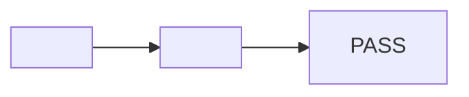

# qa-pr evidence format

This reference is the canonical shape for `qa-pr` evidence. Keep workflow and
decision rules in `SKILL.md`; keep report, manifest, chapter-link, hidden-state,
and sticky-comment shapes here.

## Evidence bundle

A frontend run publishes one logical bundle:

1. One silent H.264 MP4, or the smallest number of MP4 parts when the ten-minute
   or 100 MB limit requires splitting at an acceptance-case boundary.
2. One Snapdoc Markdown report that is the durable evidence index.
3. One sticky PR comment that links the current report and video watch pages.

A backend-only run publishes the report and sticky comment without a decorative
video. PNG screenshots may supplement a case, but they do not replace a
meaningful recorded interaction when motion or a state transition proves it.

## Report template

Sections appear in this order. Use stable acceptance-case IDs in the report,
video chapters, filenames, and comment.

````markdown
# QA evidence — <repo> PR #<number> @ <short_sha>

## Verdict

<PASS | PASS WITH NOTES | FAIL> — <one sentence>

## Traceability



## Acceptance cases

| Case | Category | Result | Evidence | Notes |
| --- | --- | --- | --- | --- |
| T1 — <title> | happy | ✅ PASS | [00:12 — T1](<version_url>?t=12.000) | <observation> |
| T2 — <title> | edge | ✅ PASS | [request/response](#t2-request-and-response) | <observation> |

### T2 request and response

```http
<sanitized literal request>
```

```json
<sanitized literal response>
```

## Bugs found and fixed

| Bug | Fix commit | Retest |
| --- | --- | --- |
| <description> | [`<short_sha>`](<commit_url>) | T1 ✅ |

<!-- Use “None.” when no bugs were found. -->

## Commit and environment manifest

<manifest table from the next section>

## Publication

| Field | Value |
| --- | --- |
| Privacy | <passcode | unlisted | public> — `passcode` unless the user opted out |
| Expires | <UTC timestamp | never> |
| Video artifact | `<id>` version `<version>` part 1 of `<count>` |
| Report artifact | `<id>` version `<version>` |
````

The case table is the browser-visible chapter interface because Snapdoc's watch
page does not expose a chapter picker. Each frontend evidence cell links to the
version-pinned watch page, seeked to the chapter start:

```markdown
[00:12 — T1](<version_url>?t=12.000)
```

Link the watch page, never the raw MP4. A `#t=` on `version_file_url` skips the
watch page entirely, so on protected or watch-only evidence every chapter link
dead-ends on a bare 401/403. `version_url?t=` shows the unlock prompt instead
and keeps the timestamp across the unlock redirect.

Use three decimal places in `?t=` values. Current-run watch links may be stable,
but report chapter links and all Previous runs links are version-pinned so a
later artifact update cannot rewrite what an older verdict proved.

## Commit and environment manifest

Normalize the final `qa-ticket` test plan as UTF-8 with LF line endings and one
terminal newline before hashing it. Render these rows in this order:

| Field | Required value |
| --- | --- |
| Repository / PR | `<owner/repo>` / linked PR URL |
| Head SHA | Full 40-character tested and published commit |
| Base SHA | Full 40-character comparison commit |
| Clean at capture | `true`, with UTC check time |
| Clean at publication | `true`, with UTC check time |
| Test-plan SHA-256 | 64 lowercase hexadecimal characters |
| Captured at | UTC RFC 3339 timestamp |
| Browser | Browser name and version |
| Viewport | `<width>x<height>` |
| Local origins | Sanitized localhost origins only; no credentials or tokens |
| Auth mode | Label only, such as `dev bypass` or `provided browser state` |
| Fixture / data set | Reproducible label or `none` |
| qa-pr revision | Skill repository commit SHA |
| agent-browser | Version |
| ffmpeg | Version |
| Snapdoc | Version |
| Video SHA-256 | Hash from `chapters.json`, or `not applicable` |
| Video details | Duration, dimensions, codec, part count, or `not applicable` |
| Privacy | `passcode` (the default), `unlisted`, or `public` |
| Expiry | UTC timestamp or `never` |
| Video artifact | ID and current version for every part, or `not applicable` |
| Report artifact | ID and current version |

Do not include passwords, passcodes, cookies, authorization headers, raw browser
state paths, private tenant/user data, query-string secrets, or unsanitized
environment variables.

## Sticky comment hidden state

The first bytes of every comment are the stable marker followed by the bot
identifier. Artifact state uses one marker per logical artifact:

```markdown
<!-- qa-pr-evidence -->
> [!NOTE]
> 🤖 Automated comment by **QA PR** — not written by a human
<!-- qa-pr-video-artifact: <id> part="1" -->
<!-- qa-pr-report-artifact: <id> -->
<!-- qa-pr-evidence-state: privacy="passcode" expires="<UTC>" parts="1" -->
```

For multipart video, repeat the normal video marker with the same logical run
and increasing part numbers:

```markdown
<!-- qa-pr-video-artifact: <part-1-id> part="1" -->
<!-- qa-pr-video-artifact: <part-2-id> part="2" -->
```

Never store a passcode in hidden state. Parse existing markers before a rerun.
When privacy is unchanged, update the referenced artifact IDs in place. When the
privacy mode must change, obtain the outward-action checkpoint and replace the
state markers only after the replacement artifacts exist.

## Sticky comment — video present

Use stable current watch/report URLs at the top and version-pinned URLs in
Previous runs.

```markdown
<!-- qa-pr-evidence -->
> [!NOTE]
> 🤖 Automated comment by **QA PR** — not written by a human
<!-- qa-pr-video-artifact: <video-id> part="1" -->
<!-- qa-pr-report-artifact: <report-id> -->
<!-- qa-pr-evidence-state: privacy="<mode>" expires="<UTC-or-never>" parts="1" -->

## QA evidence — <verdict emoji> <PASS | PASS WITH NOTES | FAIL> <sub>(@ <short_sha>)</sub>

[Watch the QA run](<stable_watch_url>) · [Open the evidence report](<stable_report_url>)

🔒 Passcode-protected — ask <requester> for the code. Expires <UTC>.

| Case | Category | Result | Evidence |
| --- | --- | --- | --- |
| T1 — <title> | happy | ✅ | [00:12](<version_url>?t=12.000) |
| T2 — <title> | edge | ✅ | [00:48](<version_url>?t=48.000) |

<bugs found and fixed, with linked SHAs, or “No bugs found.”>

<details><summary>Previous runs</summary>

- @ `<short_sha>` — <verdict> — [report](<version-pinned-report-url>) · [video](<version-pinned-watch-or-file-url>)

</details>
```

Every video link is a Snapdoc watch URL, whether the artifact is unlisted or
passcode-protected. Never embed a raw media URL — watch-only evidence has none —
and never place a passcode in GitHub; share it out of band with authorized
reviewers.

Keep the 🔒 line whenever privacy is `passcode`, and drop it entirely when the
user opted out to unlisted. Protected links render an unlock page rather than the
evidence, so without that line a reviewer reads a working link as a broken one.
Name who to ask; never hint at the code itself.

## Sticky comment — report only

Omit video markers, video links, and video manifest values when there were no
meaningful frontend cases:

```markdown
<!-- qa-pr-evidence -->
> [!NOTE]
> 🤖 Automated comment by **QA PR** — not written by a human
<!-- qa-pr-report-artifact: <report-id> -->
<!-- qa-pr-evidence-state: privacy="<mode>" expires="<UTC-or-never>" parts="0" -->

## QA evidence — <verdict emoji> <PASS | PASS WITH NOTES | FAIL> <sub>(@ <short_sha>)</sub>

[Open the evidence report](<stable_report_url>)

🔒 Passcode-protected — ask <requester> for the code. Expires <UTC>.

| Case | Category | Result | Evidence |
| --- | --- | --- | --- |
| T1 — <title> | error | ✅ | [request/response](<version-pinned-report-url>#t1-request-and-response) |

<details><summary>Previous runs</summary>

- @ `<short_sha>` — <verdict> — [report](<version-pinned-report-url>)

</details>
```

There is exactly one `<!-- qa-pr-evidence -->` comment per PR. Create it on the
first run and PATCH it thereafter. Never discard the version-pinned evidence
links from Previous runs.
